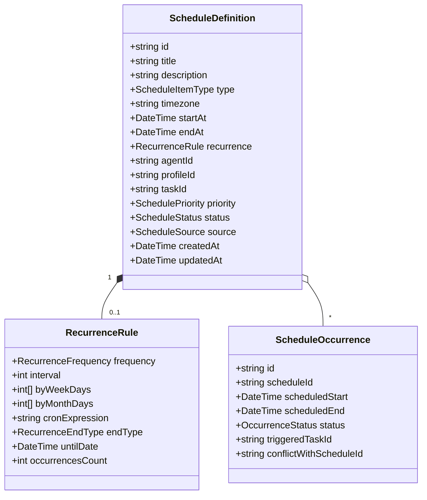

# Sagara Mission Control — Schedule Domain Proposal (RFC)

## Status: PROPOSAL ONLY (UNFROZEN)
*Document Version:* 1.0.0-draft  
*Target Backend Contract:* Future Sagara API Contract V1.1 / Scheduler Extension  
*Safety Notice:* SAGARA_MISSION_CONTROL_API_CONTRACT_V1 remains strictly frozen. This document proposes data models and API behaviors for future scheduler integration without mutating existing V1 contracts.

---

## 1. Executive Summary

Mission Control requires scheduled operational workflows, including:
1. **Recurring Agent Jobs** (e.g. daily marketing digest, morning system check).
2. **One-off Reminders & Operational Events** (e.g. follow-up leads, scheduled system reviews).
3. **Automated Scheduled Tasks** (e.g. weekly backup, cron-triggered maintenance).
4. **Calendar Visualization** (Month, Week, Day, and Agenda views) for operational transparency.

This proposal specifies the domain entities, recurrence model, occurrence expansion, and REST API surface for a production scheduler backend.

---

## 2. Core Domain Entities



### 2.1 Enumerations

#### `ScheduleItemType`
- `TASK`: An actionable task assigned to an agent.
- `REMINDER`: An operational or human alert.
- `RECURRING_JOB`: A repeated autonomous job (e.g. hourly audit).
- `CONTENT`: Content marketing and media publishing timeline item.
- `MAINTENANCE`: Infrastructure or runtime maintenance event.
- `EVENT`: Milestone, operational review, or sync meeting.

#### `ScheduleStatus`
- `SCHEDULED`: Waiting for scheduled trigger time.
- `RUNNING`: Associated job or task is currently active.
- `COMPLETED`: Execution successfully completed.
- `PAUSED`: Temporarily excluded from automatic triggers.
- `CANCELLED`: Permanently halted.
- `MISSED`: Missed execution window (e.g. system downtime).
- `UNKNOWN`: Unrecognized state from external provider.

#### `RecurrenceFrequency`
- `NONE`: One-time event.
- `DAILY`: Every N days.
- `WEEKDAYS`: Monday through Friday.
- `WEEKLY`: Every N weeks on specified days.
- `MONTHLY`: Every N months on specified day.
- `CUSTOM`: Fully custom recurrence or cron expression.

---

## 3. Conflict Detection Model

When two or more occurrences for the same agent/profile overlap in time:
```text
Overlap Condition:
StartA < EndB AND EndA > StartB
```
The scheduler surfaces an advisory `POTENTIAL_CONFLICT` flag rather than hard-failing, allowing multi-tasking agents or informing operators to stagger schedules.

---

## 4. Proposed REST API Surface (V1.1 Target)

### 4.1 List Schedules
```http
GET /api/v1/schedules?from=2026-09-01T00:00:00Z&to=2026-09-30T23:59:59Z&agent_id=marketing&type=RECURRING_JOB
```
**Response (200 OK):**
```json
{
  "items": [
    {
      "id": "sched-001",
      "type": "RECURRING_JOB",
      "title": "Daily Marketing Summary",
      "description": "Scans platform metrics and summarizes morning trends",
      "start_at": "2026-09-10T09:00:00Z",
      "end_at": "2026-09-10T09:30:00Z",
      "timezone": "Asia/Jakarta",
      "recurrence": {
        "frequency": "WEEKDAYS",
        "interval": 1,
        "cron_expression": "0 9 * * 1-5"
      },
      "agent_id": "marketing",
      "profile_id": "marketing",
      "priority": "HIGH",
      "status": "SCHEDULED",
      "source": "MISSION_CONTROL"
    }
  ],
  "total": 1
}
```

### 4.2 Expand Occurrences (Calendar View)
```http
GET /api/v1/schedules/occurrences?view=week&anchor_date=2026-09-10
```
Returns discrete occurrence items expanded from recurrence rules for fast calendar rendering.

### 4.3 Create Schedule Definition
```http
POST /api/v1/schedules
Content-Type: application/json

{
  "title": "Weekly Security Audit",
  "type": "MAINTENANCE",
  "start_at": "2026-09-15T02:00:00Z",
  "end_at": "2026-09-15T03:00:00Z",
  "agent_id": "it_support",
  "recurrence": {
    "frequency": "WEEKLY",
    "interval": 1,
    "by_week_days": [2]
  }
}
```

---

## 5. Frontend Isolation Architecture

Prior to backend implementation:
1. Frontend uses an in-memory & `localStorage` prototype store (`schedule-store.ts`).
2. All prototype schedules are explicitly marked with `source: 'PROTOTYPE'`.
3. UI banners display `PROTOTYPE DATA — Local preview only`.
4. No network requests are dispatched to non-existent backend endpoints.
